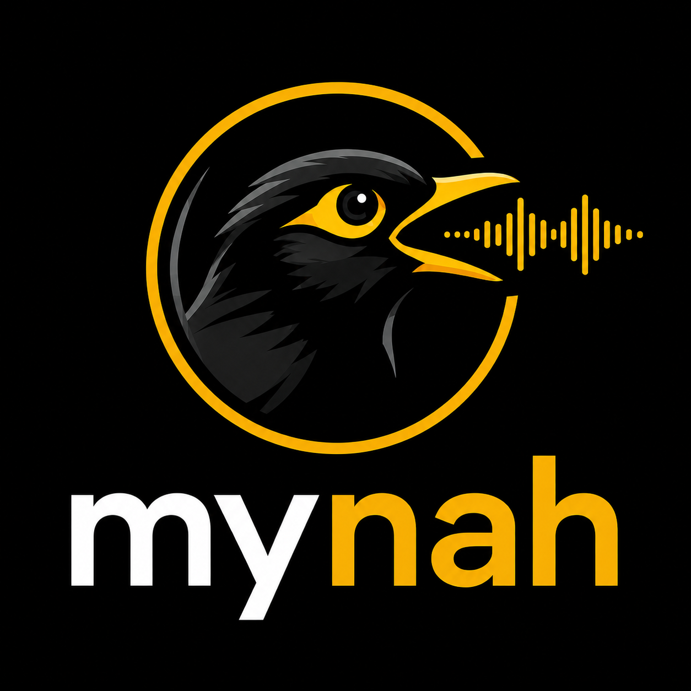

<p align="center">
  
</p>

# Mynah TTS

[](https://github.com/mynah-org/mynah-tts/actions/workflows/build.yml)
[](https://github.com/mynah-org/mynah-tts/actions/workflows/codeql.yml)
[](https://github.com/mynah-org/mynah-tts/actions/workflows/safety.yml)
[](https://github.com/mynah-org/mynah-tts/releases/latest)
[](docs/voices-and-languages.md)
[](docs/voices-and-languages.md)
[](LICENSE)

Fast native C11 inference engine for text-to-speech — llama.cpp-style, no Python
at runtime. Today it runs NVIDIA MagpieTTS v2607 with NanoCodec; the engine seam
is built to host more models tomorrow.

**Faster than real time on a 2020 M1, CPU only** — RTF 0.36 at int8, no GPU
needed.

## Features

- **Pure C11, zero runtime dependencies.** One binary. Python is offline tooling
  only — conversion, tokenizer export, oracle parity.
- **CPU-first.** Tuned for Apple Silicon and x86; Metal and CUDA are optional,
  opt-in builds that fall back to CPU safely.
- **Quantized decode.** `f16`, `int8` and `int4` weights, converted at load.
  f32 stays the bit-exact default.
- **Faster than real time.** RTF 0.257 on a mainstream NVIDIA GPU, 0.361 on an
  M1 CPU. See [performance](docs/performance.md).
- **Offline, streaming and an OpenAI-compatible server** over one autoregressive
  state machine — the streamed audio is sample-identical to the batch output.
- **Continuous request batching** in the server, vLLM-style: concurrent requests
  share one pass over the decode weights (1.63x aggregate at 8 in flight), each
  still byte-identical to the same request run alone.
- **Memory-mapped weights**, reused scratch, no allocation in the decode loop.
- **Verified against the official NeMo oracle**, with per-stage parity tests and
  model-free kernel self-tests on every ISA.

## Performance

RTF = synthesis time ÷ audio duration; **below 1.0 is faster than real time**.

| Model | Device | Backend | Precision | RTF |
|---|---|---|---|---|
| Magpie 357M v2607 | NVIDIA RTX 4060-class (~270 GB/s) | CUDA + cuBLAS | f32 / FP16 weights | **0.257** |
| Magpie 357M v2607 | Apple M1 | CPU (Accelerate) | **int8** | **0.361** |
| Magpie 357M v2607 | Apple M1 | CPU (Accelerate) | f16 | 0.495 |
| Magpie 357M v2607 | Apple M1 | CPU (Accelerate) | f32 | 0.662 |
| Magpie 357M v2607 | Apple M1 | Metal | f32 | 0.723 |

"Magpie 357M v2607" is `nvidia/magpie_tts_multilingual_357m` at revision v2607
with `nemo-nano-codec-22khz`, the one model shipping today — the column is there
because RTF means nothing without it, and the next engine will not match these
numbers.

ARM64 is covered by the M1 rows above. x86-64 and server-class ARM have never
been benchmarked for this model — see [docs/performance.md](docs/performance.md).

Decode is bound by memory bandwidth, not arithmetic — which is why quantization
is the big lever and why, on Apple Silicon's unified memory, the GPU is *slower*
than four CPU threads. The full analysis, the measured improvements and how to
benchmark your own box are in **[docs/performance.md](docs/performance.md)**.

## Quick start

Four steps from a clean checkout to a WAV. No HuggingFace account, no token, no
Python at runtime.

**1. Build**

```bash
make                 # CPU build, never needs a GPU SDK
make self-test       # kernel correctness on this ISA
```

**2. Download the checkpoints** — all three repos are public and ungated:

```bash
./download_model.sh              # Magpie + NanoCodec + ByT5 tokenizer assets
./download_model.sh --what tts   # or fetch one at a time
```

**3. Convert them into a model pack** — done once. The runtime never downloads
weights implicitly and never loads a raw `.nemo`:

```bash
make convert \
  MODEL=models/magpie-v2607/magpie_tts_multilingual_357m.nemo \
  CODEC=models/nano-codec-22khz/nemo-nano-codec-22khz-1.89kbps-21.5fps.nemo \
  OUTPUT=models/magpie-v2607-pack

make tokenizer \
  MODEL=models/magpie-v2607/magpie_tts_multilingual_357m.nemo \
  CODEC=models/nano-codec-22khz/nemo-nano-codec-22khz-1.89kbps-21.5fps.nemo \
  BYT5=models/byt5-small-tokenizer \
  OUTPUT=models/magpie-v2607-pack/tokenizer/english_phoneme.tsv
```

**4. Synthesize**

```bash
./build/cpu/mynah-tts --synthesize models/magpie-v2607-pack \
  --text "hello from mynah" --lang en \
  --output build/native.wav --speaker 4 --seed 42
```

`--speaker 4` is **Sofia**; the pack ships 5 voices and 12 languages. The IDs,
the language codes and the other ways to pass text are in
**[docs/voices-and-languages.md](docs/voices-and-languages.md)**.

Run quantized with `MYNAH_QUANT=int8` (or `f16` / `int4`) — see
**[docs/quantization.md](docs/quantization.md)** for the accuracy trade-offs.

## More build options

```bash
make info                                   # compiler, OS, arch, BLAS, SIMD
./build/cpu/mynah-tts --inspect models/magpie-v2607-pack
```

Optional GPU builds use separate object directories, so CPU/Metal/CUDA objects
can never be mixed:

```bash
make metal && build/metal/mynah-tts --gpu-self-test metal   # macOS
make cuda  && build/cuda/mynah-tts  --gpu-self-test cuda    # Linux/NVIDIA
```

A model pack carries `model.json`, the tts/codec safetensors, tokenizer assets,
speakers and license metadata. Model files, generated WAVs, build output and the
local `.venv` are all gitignored.

Weights are read through [ingot](https://github.com/mynah-org/ingot), vendored
as a **git subtree** in `third_party/ingot`: a plain `git clone` already
contains it — no submodule init, nothing extra to fetch. When upstream ingot
gains something you want, `make update-ingot` (on a clean working tree) pulls
it in as a single squashed commit.

## Server (OpenAI-compatible, with continuous batching)

A real production-shaped HTTP server in plain C sockets — no framework, one
binary:

```bash
make server
./build/cpu/mynah-tts-server -m models/magpie-v2607-pack -p 8080

# OpenAI shape
curl -X POST http://localhost:8080/v1/audio/speech \
  -H 'Content-Type: application/json' \
  -d '{"input":"hello from mynah","voice":"Sofia"}' -o speech.wav

# native shape, same audio, honest field names
curl -X POST http://localhost:8080/v1/tts \
  -H 'Content-Type: application/json' \
  -d '{"text":"hello from mynah","speaker":"Sofia"}' -o speech.wav

curl http://localhost:8080/v1/voices          # ids and names
curl http://localhost:8080/v1/models          # OpenAI-shaped listing
curl http://localhost:8080/health             # liveness
```

Requests accept `seed`, `temperature`, `top_k`, `max_steps`, `language` and
`"stream": true` for chunked PCM as it is generated, sample-identical to the
batch response.

**Concurrent requests are batched, vLLM-style.** Offline requests are not
serialized behind a lock: a scheduler admits everything queued into one
weight-stationary decode — per-request KV, RNG and EOS, one pass over the
decode weights for all of them (up to 16 in flight). Measured 1.63x aggregate
throughput at eight concurrent, and stronger than vLLM on one axis: each
request's audio is **byte-identical** to the same request run alone, whatever
it happened to batch with. Streaming requests run one at a time by design —
their callback interleaves with generation.

The plumbing is what you would expect of a real server: a fixed worker pool
(`-w`, default 4) drains a bounded connection queue, sheds load with `503` +
`Retry-After` when full, and puts 30 s timeouts on every accepted socket so a
silent client cannot pin a worker. It binds to loopback and has no auth or
TLS — put a proxy in front of anything public.

`make server-test MODEL_DIR=...` runs the 15-check suite: every route, three
identical requests returning byte-identical audio, stream/batch parity, four
concurrent clients matching their solo runs, a request arriving mid-synthesis,
and mixed streaming+batch load. Details: **[docs/server.md](docs/server.md)**.

## Streaming (C API)

`mynah_tts_stream_open/push/flush/close` accept token chunks for long-form
input — this is what the server's streaming mode is built on. `flush` drives the
same autoregressive graph offline synthesis uses and emits causal, already-stable
PCM prefixes through fixed-size callback chunks; each chunk decodes only a
bounded suffix of the codec state rather than the whole prefix, so cost stays
flat as the utterance grows, and a stream that stops early is reported as an
error instead of ending silently. The stream is sample-identical to offline
synthesis for the same request, which is what `make stream-test` checks:

```bash
make stream-test MODEL_DIR=models/magpie-v2607-pack
```

There is one state machine behind both paths, so an offline fix cannot silently
diverge from the streaming one.

## Docs

- **[Performance](docs/performance.md)** — RTF tables, the bandwidth analysis,
  threading, the Metal verdict, benchmarking your own machine
- **[Quantization](docs/quantization.md)** — f16/int8/int4 trade-offs and how to
  judge quantized audio
- **[Server](docs/server.md)** — the OpenAI-compatible HTTP API, streaming,
  request batching and its memory cost
- **[Voices and languages](docs/voices-and-languages.md)** — speaker IDs and
  their names, the 12 language codes, and the three ways to pass text
- **[Oracle parity](docs/oracle-parity.md)** — validation against the official
  NeMo implementation

## License

This runtime is MIT licensed — see [LICENSE](LICENSE).

That covers the C runtime and tooling in this repository only. **Model weights
are licensed separately and are not distributed here**: the Magpie checkpoint is
under the NVIDIA Open Model License and NanoCodec under its own terms. Converting
a checkpoint into a model pack does not relicense it, and redistributing a pack
is a separate question from redistributing this code.
