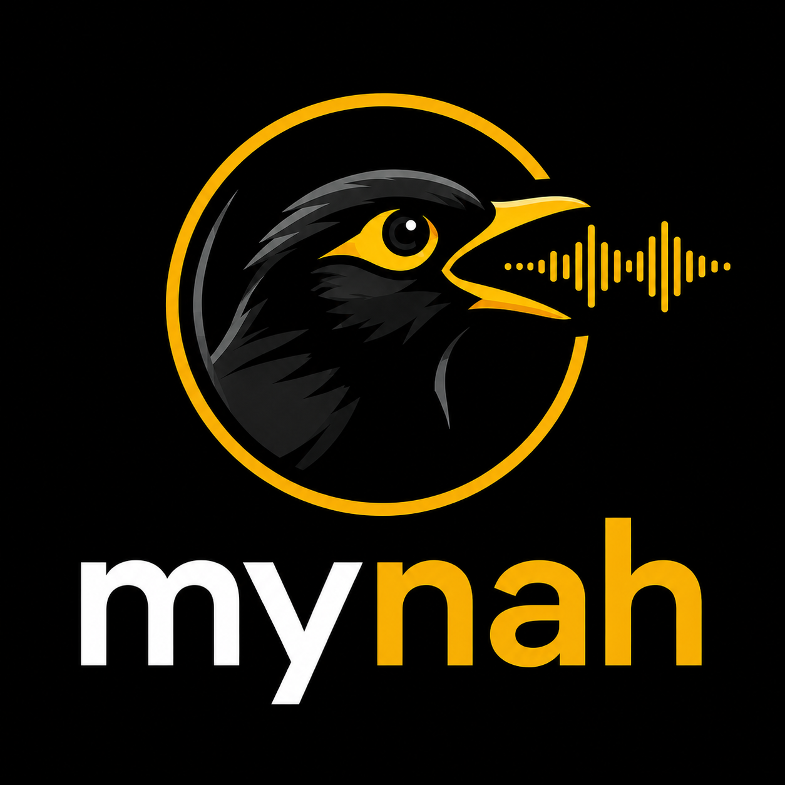

<p align="center">
  
</p>

# Mynah TTS

[](https://github.com/mynah-org/mynah-tts/actions/workflows/build.yml)
[](https://github.com/mynah-org/mynah-tts/actions/workflows/codeql.yml)
[](https://github.com/mynah-org/mynah-tts/actions/workflows/safety.yml)
[](https://github.com/mynah-org/mynah-tts/releases/latest)
[](docs/voices-and-languages.md)
[](docs/voices-and-languages.md)
[](LICENSE)

Fast native C11 inference engine for text-to-speech — llama.cpp-style, no Python
at runtime. It runs two engines behind one seam:

- **Kyutai Pocket TTS (English, 6-layer and 24-layer)** — the reference,
  production-quality model, streamed in real time on both CPU and CUDA:
  - **CPU only:** a 32-core Arm server streams 164 concurrent 6-layer requests,
    or 88 of the 24-layer model (30-minute soaks, zero stalls);
  - **one NVIDIA L4:** the 24-layer model streams 288-320 concurrent requests in
    screens with the current defaults, and 160 are qualified by 30-minute soaks;
  - **one NVIDIA L40S:** 384 concurrent 24-layer streams at stream RTF p95 0.49
    in a screen.

  See the [CUDA serving guide](docs/cuda-serving.md) and
  [performance](docs/performance.md).
- **NVIDIA MagpieTTS v2607** with NanoCodec — 12 languages, 5 voices.

**Faster than real time on a 2020 M1, CPU only** — Magpie RTF 0.36 at int8, no GPU
needed.

## Features

- **Pure C11, zero runtime dependencies.** One binary. Python is offline tooling
  only — conversion, tokenizer export, oracle parity.
- **CPU-first.** Own kernels for Arm (NEON dot, I8MM, BFMMLA) and x86 (AVX2,
  AVX-512, VNNI, AVX512-BF16), picked at run time from what the CPU reports.
  No BLAS needed (`BLAS=none` is the Linux default). Metal and CUDA are
  optional, opt-in builds that fall back to the CPU safely.
- **Quantized decode.** `f16`, `int8`, `int4` and `bf16` weights, converted at
  load. For Magpie, f32 stays the bit-exact default. Pocket TTS ships a measured
  per-tensor mix on the CPU: codec int8, backbone bf16 (int8 on the 24-layer
  model), flow head f16.
- **Faster than real time.** Pocket TTS serves hundreds of concurrent streams
  per GPU and 164 per 32-core CPU. Magpie runs at RTF 0.257 on a mainstream
  NVIDIA GPU and 0.361 on an M1 CPU. See [performance](docs/performance.md).
- **Offline, streaming and an OpenAI-compatible server** over one autoregressive
  state machine — the streamed audio is sample-identical to the batch output.
- **Continuous request batching** in the server, vLLM-style: concurrent requests
  share one pass over the decode weights (1.63x aggregate at 8 in flight), each
  still byte-identical to the same request run alone.
- **Memory-mapped weights**, reused scratch, no allocation in the decode loop.
- **Verified against the official NeMo oracle**, with per-stage parity tests and
  model-free kernel self-tests on every ISA.

## Performance

RTF = synthesis time ÷ audio duration; **below 1.0 is faster than real time**.

### Pocket TTS — concurrent streaming

Closed-loop saturated load on the v2 English corpus, four voices; "streams" is
how many requests stream at once with every one faster than real time.

| Model | Hardware | Backend | Streams | Stream RTF p95 | Audio-s per s | First audio p95 | Status |
|---|---|---|---:|---:|---:|---:|---|
| Pocket 24L | 1x NVIDIA L40S (48 GB) | CUDA | **1024** | 0.746 | 1283 | 106 ms | 2-min screen, `ROW_CAP=1024` build, large-row defaults ([cuda-serving](docs/cuda-serving.md#serving-loop-defaults-2026-10-07-and-large-row-serving)) |
| Pocket 24L | 1x NVIDIA L4 (24 GB) | CUDA | **320** | 0.855 | 338 | 146 ms | 2-min screen, current defaults |
| Pocket 24L | 1x NVIDIA L4 (24 GB) | CUDA | 288 | 0.782 | 335 | 134 ms | 2-min screen, current defaults |
| Pocket 24L | 1x NVIDIA L4 (24 GB) | CUDA | 160 | 0.855 | 184.5 | 155 ms | qualified, 2 x 30 min, WER checked |
| Pocket 6L | 1x NVIDIA L4 (24 GB) | CUDA | 256 | 0.794 | 316 | 145 ms | qualified, 2 x 30 min, WER checked |
| Pocket 6L | GCP Axion c4a, 32 cores | CPU | 164 | 0.881 | 193 | 179 ms | qualified, 30 min |
| Pocket 24L | GCP Axion c4a, 32 cores | CPU | 88 | 0.756 | 121 | 278 ms | qualified, 30 min |

The CUDA path keeps weights, KV and codec state resident and runs one batched
step for all streams. On by default: shared voice-prefix KV, split
(flash-decoding) decode attention, bf16 backbone Linears through cuBLASLt with
fused layers, a fused SEANet decoder, one host sync per frame, a per-request
device-memory diet and int8 backbone KV. Profiles with every setting and its
measured effect: [`configs/perf/`](configs/perf/README.md).

On an L40S the limit was the single scheduler thread, not the GPU. With the
serving-loop defaults of 2026-10-07 (the eleven loop flags, then the
host-context pool, step and decode overlap and fixed KV slots, all on by
default on CUDA since the same day) one L40S holds C1024 for a
30-minute soak at RTF p95 0.746, zero stalls, first audio p95 106 ms, ~1,400
audio-s/s with the GPU 96 % busy; the eleven loop flags alone hold C768. The
new defaults also make the L4 faster: C320 367 -> 382 audio-s/s, TTFA p95
137 -> 121 ms. In a 4-vCPU
affinity experiment (server pinned to 4 vCPUs) C1024 still held a 10-minute soak
at RTF p95 0.752. The English 6-layer model holds C1536 at RTF p95 0.823 (~1,950
audio-s/s) in a 30-minute soak. Per-GPU thresholds (L40S, RTX 6000 Ada, L4)
and the host lessons:
[performance](docs/performance.md#pocket-cuda-serving-thresholds-2026-10);
how they are measured, and on which Vast.ai hosts: [benchmarking](docs/benchmarking.md).
Copy-paste build, server and load-test commands:
[large-row quick start](docs/cuda-serving.md#quick-start-large-row-serving).
The story of how it got there: [blog post, from an L4 to C1024 on one L40S](blog/pocket-tts-l4-to-l40s-c1024.md).

### Pocket TTS on the CPU — what got it there

Same host (GCP Axion c4a, 32 Neoverse-V2 cores, `BLAS=none`), same mixed v2
bank, 30-minute soaks, highest level with every gate passed (zero stalls at
250 and 500 ms). From C96 on, every row is the shipped default of its day
with nothing exported; C90 was measured with the codec int8 setting exported,
which became the default the next morning.

| Date | 6L qualified | Audio-s per s | What changed |
|---|---:|---:|---|
| before 2026-09-18 | none | — | the 30-minute soaks at C96-C99 all stalled |
| 2026-09-18 | C90 | 128.9 | resumable prefill in 32-token slices with a per-step prefill budget; 16 workers x 2 threads |
| 2026-09-19 | C96 | 130.2 | codec ConvTranspose in int8 by default (1.86x on the per-slot term); prefill budget set from the measured step slack |
| 2026-09-19 | C110 | 152.7 | bf16 backbone through a tiled BFMMLA kernel |
| 2026-09-19 | C120 | 155.3 | prefill budget re-measured for the new kernel (40 ms) |
| 2026-09-21 | C126 | 157.4 | same build, the frontier re-measured (C128 fails by 3 stalls in 65,295) |
| 2026-09-27 | **C164** | **193.3** | wide I8MM kernel (int8 weights read once per eight activations), attention heads on the thread pool, text segmentation (TTFA p95 246 -> 143 ms at C120), `--max-batch 12` |

The 24-layer pack went from ~C40-48 to **C88** (121 audio-s/s) on the same
host. The gains came from an int8 backbone (on 24L the per-step weight pass is
big enough to pay: -39% step time at one row), the same segmentation and
16-token prefill slices. On x86 the kernels now dispatch at run time: AVX2,
AVX-512BW, AVX-512 VNNI (int8 2.27x over AVX2) and AVX512-BF16 `VDPBF16PS`
(bf16 2.98x over the widening kernel). Each tier is proven against the scalar
reference on first use before it is selected. These are kernel benchmarks on
a Zen 4 host. The first x86 serving figures (2026-10-08) are on the low
tier: an AMD EPYC 7702 with AVX2 and FMA only (no AVX-512, no VNNI), ~24 vCPUs
of quota, where new AVX2 kernels (an exact int8 sign-trick dot, a 6x16 FMA
tile, laid-out codec convs) took the streaming knee from C12 to **C24** on
the 24L and to about **C36** on the 6L (2-3 minute screens at the knee), byte-identical audio.
Detail: [performance](docs/performance.md).

### Magpie — single request

| Model | Device | Backend | Precision | RTF |
|---|---|---|---|---|
| Magpie 357M v2607 | NVIDIA RTX 4060-class (~270 GB/s) | CUDA + cuBLAS | f32 / FP16 weights | **0.257** |
| Magpie 357M v2607 | Apple M1 | CPU (Accelerate) | **int8** | **0.361** |
| Magpie 357M v2607 | Apple M1 | CPU (Accelerate) | f16 | 0.495 |
| Magpie 357M v2607 | Apple M1 | CPU (Accelerate) | f32 | 0.662 |
| Magpie 357M v2607 | Apple M1 | Metal | f32 | 0.723 |
| Magpie 357M v2607 | AMD EPYC 9555P (Zen 5), 4 vCPU | CPU (OpenBLAS, AVX2) | **int8** | 0.427 |
| Magpie 357M v2607 | AMD EPYC 9555P (Zen 5), 4 vCPU | CPU (OpenBLAS, AVX2) | f32 | 0.806 |

"Magpie 357M v2607" is `nvidia/magpie_tts_multilingual_357m` at revision v2607
with `nemo-nano-codec-22khz` — the column is there because RTF means nothing
without it.

ARM64 is covered by the M1 rows above, x86-64 by the EPYC rows — a 4 vCPU
cloud slice where the int8 lane is a **1.9×** speedup over f32 and self-test
plus end-to-end synthesis were verified on the box. **Those numbers were taken
on an AVX2 build**: the int8 dot they ran was `_mm256_madd_epi16`, and Linux x86
builds default to `-mavx2 -mfma`. A VNNI lane exists now — `src/qmat.c` carries
both an EVEX `_mm512_dpbusd_epi32` kernel and a VEX `_mm256_dpbusd_avx_epi32`
one, each behind a target attribute so neither needs a build flag, selected at
runtime by CPUID — but it had not been written when 0.427 was measured and that
figure does not include it. So **0.427 remains a floor for x86, not a ceiling**,
and what would move it has not been measured on a host that resolves to VNNI.
`--dispatch-map` prints which kernel a given host actually resolved, and is the
only honest answer to "is VNNI on here". Server-class ARM (Grace, Graviton) has
never been benchmarked — see [docs/performance.md](docs/performance.md).

Decode is bound by memory bandwidth, not arithmetic — which is why quantization
is the big lever and why, on Apple Silicon's unified memory, the GPU is *slower*
than four CPU threads. The full analysis, the measured improvements and how to
benchmark your own box are in **[docs/performance.md](docs/performance.md)**.

## Quick start — Pocket TTS

From a clean checkout to a WAV on the CPU. `kyutai/pocket-tts` is a gated
Hugging Face repository: accept its terms there and export a read token once.
Python is needed only for the one-time conversion.

```bash
make && make self-test
export HF_TOKEN=hf_...
uv run --with huggingface_hub python -c \
  "from huggingface_hub import snapshot_download as d; d('kyutai/pocket-tts')"
make convert-pocket POCKET_LANG=english_2026-04     POCKET_OUT=models/pocket-en      # 6 layers
make convert-pocket POCKET_LANG=english_2026-04_24l POCKET_OUT=models/pocket-en-24l  # 24 layers

./build/cpu/mynah-tts --synthesize models/pocket-en \
  --text "Hello from the CPU." --lang en --speaker 0 --output build/pocket.wav
```

Speaker 0 is `alba`, the recommended voice
([docs/pocket-voices.md](docs/pocket-voices.md)). To serve it, the
qualified 32-core profile prints its own command:

```bash
make server
python3 tools/perf_profile.py command axion-c4a-32c-pocket-en --model models/pocket-en --port 8080
# ./build/cpu/mynah-tts-server -m models/pocket-en -p 8080 --prefork 16 --prefork-threads 2 --max-batch 12
```

On a different host, re-screen the worker shape (`configs/perf/README.md`). On
an NVIDIA GPU, follow [docs/cuda-serving.md](docs/cuda-serving.md).

## Quick start — Magpie

Four steps from a clean checkout to a WAV. No HuggingFace account, no token, no
Python at runtime.

**1. Build**

```bash
make                 # CPU build, never needs a GPU SDK
make self-test       # kernel correctness on this ISA
```

**2. Download the checkpoints** — all three repos are public and ungated:

```bash
./download_model.sh              # Magpie + NanoCodec + ByT5 tokenizer assets
./download_model.sh --what tts   # or fetch one at a time
```

**3. Convert them into a model pack** — done once. The runtime never downloads
weights implicitly and never loads a raw `.nemo`:

```bash
make convert \
  MODEL=models/magpie-v2607/magpie_tts_multilingual_357m.nemo \
  CODEC=models/nano-codec-22khz/nemo-nano-codec-22khz-1.89kbps-21.5fps.nemo \
  OUTPUT=models/magpie-v2607-pack

make tokenizer \
  MODEL=models/magpie-v2607/magpie_tts_multilingual_357m.nemo \
  CODEC=models/nano-codec-22khz/nemo-nano-codec-22khz-1.89kbps-21.5fps.nemo \
  BYT5=models/byt5-small-tokenizer \
  OUTPUT=models/magpie-v2607-pack/tokenizer/english_phoneme.tsv
```

**4. Synthesize**

```bash
./build/cpu/mynah-tts --synthesize models/magpie-v2607-pack \
  --text "hello from mynah" --lang en \
  --output build/native.wav --speaker 4 --seed 42
```

`--speaker 4` is **Sofia**; the pack ships 5 voices and 12 languages. The IDs,
the language codes and the other ways to pass text are in
**[docs/voices-and-languages.md](docs/voices-and-languages.md)**.

Run quantized with `MYNAH_QUANT=int8` (or `f16` / `int4`) — see
**[docs/quantization.md](docs/quantization.md)** for the accuracy trade-offs.

## More build options

```bash
make info                                   # compiler, OS, arch, BLAS, SIMD
./build/cpu/mynah-tts --inspect models/magpie-v2607-pack
```

Optional GPU builds use separate object directories, so CPU/Metal/CUDA objects
can never be mixed:

```bash
make metal && build/metal/mynah-tts --gpu-self-test metal   # macOS
make cuda  && build/cuda/mynah-tts  --gpu-self-test cuda    # Linux/NVIDIA
```

Pocket TTS runs the official 6-layer and 24-layer packs on the CPU and, with
`make cuda`, fully resident on an NVIDIA GPU of compute capability 8.0 or newer:
backbone, flow head, Mimi transformer and SEANet decoder, batched across
streams. It is measured on an L4 and an L40S (`sm_89`) and was exercised
earlier on Blackwell (`sm_120`). A CUDA server refuses to start rather than run
a hot stage on the CPU under a CUDA label. The serving guide is
[docs/cuda-serving.md](docs/cuda-serving.md).

A model pack carries `model.json`, the tts/codec safetensors, tokenizer assets,
speakers and license metadata. Model files, generated WAVs, build output and the
local `.venv` are all gitignored.

Weights are read through [ingot](https://github.com/mynah-org/ingot), vendored
as a **git subtree** in `third_party/ingot`: a plain `git clone` already
contains it — no submodule init, nothing extra to fetch. When upstream ingot
gains something you want, `make update-ingot` (on a clean working tree) pulls
it in as a single squashed commit.

## Server (OpenAI-compatible, with continuous batching)

A real production-shaped HTTP server in plain C sockets — no framework, one
binary:

```bash
make server
./build/cpu/mynah-tts-server -m models/magpie-v2607-pack -p 8080

# OpenAI shape
curl -X POST http://localhost:8080/v1/audio/speech \
  -H 'Content-Type: application/json' \
  -d '{"input":"hello from mynah","voice":"Sofia"}' -o speech.wav

# native shape, same audio, honest field names
curl -X POST http://localhost:8080/v1/tts \
  -H 'Content-Type: application/json' \
  -d '{"text":"hello from mynah","speaker":"Sofia"}' -o speech.wav

curl http://localhost:8080/v1/voices          # ids and names
curl http://localhost:8080/v1/models          # OpenAI-shaped listing
curl http://localhost:8080/health             # liveness
curl http://localhost:8080/metrics            # Prometheus counters/gauges
```

Requests accept `seed`, `temperature`, `top_k`, `max_steps`, `language` and
`"stream": true` for chunked PCM as it is generated, sample-identical to the
batch response.

**PocketTTS on an NVIDIA GPU**: one L4 is qualified at 160 concurrent streams
of the 24-layer model and 256 of the 6-layer one (two 30-minute saturated
soaks each, zero stalls, first audio p95 ~150 ms), and with the current
defaults the 24-layer model screens at 320 streams (RTF p95 0.855, 338
audio-s/s, 16.3 GB). Convert the model with `tools/convert_pocket.py`, build
with `make cuda-server cuda CUDA_ARCH=sm_89` and start it from the serving
profile:

```bash
python3 tools/perf_profile.py command l4-24g-pocket-en-24l-cuda --model models/pocket-english-24l --port 8080
# MYNAH_QUANT_GROUPS=none MYNAH_SERVE_PROFILE=1 MYNAH_THREADS=1 \
#   build/cuda/mynah-tts-server --device cuda -w 8 --max-batch 320 --max-inflight 320 -p 8080 -m models/pocket-english-24l
```

Every CUDA optimisation is on by default; the environment only needs
`MYNAH_THREADS=1` (`MYNAH_CUDA_KV_DTYPE=bf16` is the rollback for workloads
whose rows have no shared model-voice KV, see the guide). The full guide (models,
streaming requests, sizing another GPU, every `MYNAH_CUDA_*` switch with its
measured effect, monitoring, troubleshooting and the qualification procedure)
is **[docs/cuda-serving.md](docs/cuda-serving.md)**.

**Concurrent requests are batched, vLLM-style.** Offline requests are not
serialized behind a lock: a scheduler admits everything queued into one
weight-stationary decode — per-request KV, RNG and EOS, one pass over the
decode weights for each bounded engine microbatch (up to 16 by default).
`--max-inflight` can retain more resident streaming slots without widening that
microbatch. Measured 1.63x aggregate
throughput at eight concurrent, and stronger than vLLM on one axis: each
request's audio is **byte-identical** to the same request run alone, whatever
it happened to batch with. Streaming requests join the same bounded scheduler
and their callbacks interleave with generation; the resident-slot ceiling is
independent from the arithmetic microbatch width.

The plumbing is what you would expect of a real server: a fixed worker pool
(`-w`, default 4) drains a bounded connection queue, sheds load with `503` +
`Retry-After` when full, and puts 30 s timeouts on every accepted socket so a
silent client cannot pin a worker. It binds to loopback and has no auth or
TLS — put a proxy in front of anything public.

`make server-test MODEL_DIR=...` runs the 15-check suite: every route, three
identical requests returning byte-identical audio, stream/batch parity, four
concurrent clients matching their solo runs, a request arriving mid-synthesis,
and mixed streaming+batch load. Details: **[docs/server.md](docs/server.md)**.

## Streaming (C API)

`mynah_tts_stream_open/push/flush/close` accept token chunks for long-form
input — this is what the server's streaming mode is built on. `flush` drives the
same autoregressive graph offline synthesis uses and emits causal, already-stable
PCM prefixes through fixed-size callback chunks; each chunk decodes only a
bounded suffix of the codec state rather than the whole prefix, so cost stays
flat as the utterance grows, and a stream that stops early is reported as an
error instead of ending silently. The stream is sample-identical to offline
synthesis for the same request, which is what `make stream-test` checks:

```bash
make stream-test MODEL_DIR=models/magpie-v2607-pack
```

There is one state machine behind both paths, so an offline fix cannot silently
diverge from the streaming one.

## Docs

- **[Performance](docs/performance.md)** — Pocket TTS serving results on CPU
  and CUDA, how each was reached, RTF tables, the bandwidth analysis, threading,
  the Metal verdict, benchmarking your own machine
- **[Serving Pocket TTS on a GPU](docs/cuda-serving.md)** — build, start,
  size, tune, monitor and qualify the CUDA server
- **[Benchmarking](docs/benchmarking.md)** — the GPU serving screen: closed-loop
  knees, NUMA pinning, thermal pre-check, audio-identity checks, reading the
  serving profile
- **[Serving profiles](configs/perf/README.md)** — the measured server
  configuration per host and engine, and the validator that enforces it
- **[Quantization](docs/quantization.md)** — f16/int8/int4 trade-offs and how to
  judge quantized audio
- **[Server](docs/server.md)** — the OpenAI-compatible HTTP API, streaming,
  request batching and its memory cost
- **[Voices and languages](docs/voices-and-languages.md)** — speaker IDs and
  their names, the 12 language codes, and the three ways to pass text
- **[Pocket voices](docs/pocket-voices.md)** — which Pocket TTS voice to use
  (`alba`), measured quality and licence of each
- **[Oracle parity](docs/oracle-parity.md)** — validation against the official
  NeMo implementation

## License

This runtime is MIT licensed — see [LICENSE](LICENSE).

That covers the C runtime and tooling in this repository only. **Model weights
are licensed separately and are not distributed here**: the Magpie checkpoint is
under the NVIDIA Open Model License and NanoCodec under its own terms. Converting
a checkpoint into a model pack does not relicense it, and redistributing a pack
is a separate question from redistributing this code.
